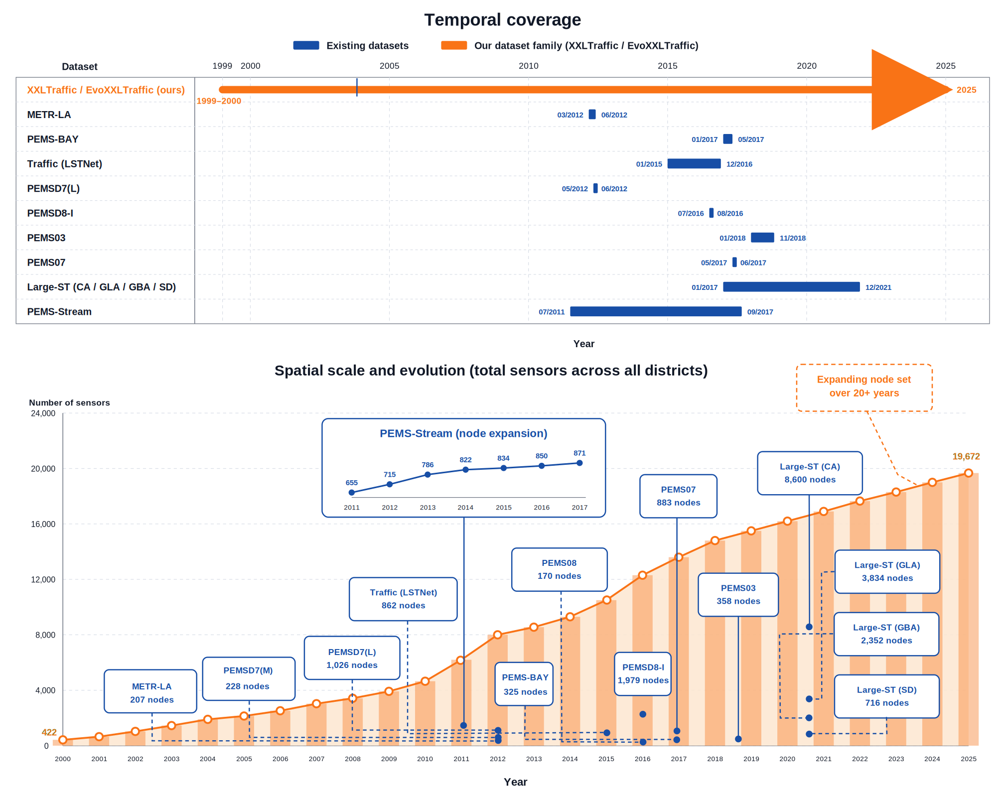

<div align="center">
  <h2><b>EvoXXLTraffic: Evolving-Graph Traffic Forecasting under Extreme Sensor Growth</b></h2>
</div>

This directory accompanies the **TSAS'26** submission (`TSAS26_EVOXXLTraffic_Du_Yin/`) and documents the dataset, task, and baseline organisation that backs the main experimental tables ([`tables/tsas_main_table_part1.tex`](tables/tsas_main_table_part1.tex), [`tables/tsas_main_table_part2.tex`](tables/tsas_main_table_part2.tex)). All baselines below are implemented in [`eac/`](eac).

---

## 📊 Dataset and Task

We benchmark continual spatio-temporal forecasting on **EvoXXLTraffic** — a long-horizon extension of the PEMS family that spans up to **25 years** per district and exhibits **sensor-count growth of up to $+9{,}433\%$** between the first and last year. The task is *evolving-graph traffic forecasting*: at each period $\tau$ the sensor set $\mathcal{V}_\tau$ may expand (newly installed sensors) and the underlying graph $\mathcal{G}_\tau$ grows, while the model must keep predicting the next $3 / 6 / 12$ steps.

<p align="center">
    
</p>

> 📄 PDF version: [`fig/new1.pdf`](fig/new1.pdf) · prototype diagram: [`fig/proto.pdf`](fig/proto.pdf)

### Comparison with existing traffic datasets

LaTeX source: [`TSAS26_EVOXXLTraffic_Du_Yin/table/data1.tex`](table/data1.tex).

| Reference | Dataset | Samples | Nodes | Interval | Span | Period |
|---|---|---:|---:|---|---|---|
| DCRNN | METR-LA | 34{,}272 | 207 | 5 min | 4 mo | 03/2012–06/2012 |
| DCRNN | PEMS-BAY | 52{,}116 | 325 | 5 min | 6 mo | 01/2017–05/2017 |
| LSTNet | Traffic | 17{,}544 | 862 | 1 h | 2 yr | 01/2015–12/2016 |
| STSGCN | PEMS03 | 26{,}208 | 358 | 5 min | 11 mo | 01/2018–11/2018 |
| STSGCN | PEMS04 | 16{,}992 | 307 | 5 min | 2 mo | 01/2018–02/2018 |
| STSGCN | PEMS07 | 28{,}224 | 883 | 5 min | 2 mo | 05/2017–06/2017 |
| STSGCN | PEMS08 | 17{,}856 | 170 | 5 min | 2 mo | 07/2016–08/2016 |
| Large-ST | CA / GLA / GBA / SD | 525{,}888 | 716 – 8{,}600 | 5 min | 5 yr | 01/2017–12/2021 |
| **Ours** | **PEMS03**$_\text{gap\&agg}$ | 2{,}629{,}513 | 151 | Gap/Hr/Day | **23.00 yr** | 03/2001–03/2024 |
| **Ours** | **PEMS04**$_\text{gap\&agg}$ | 2{,}486{,}472 | 822 | Gap/Hr/Day | **21.75 yr** | 06/2002–03/2024 |
| **Ours** | **PEMS05**$_\text{gap\&agg}$ | 1{,}371{,}879 | 103 | Gap/Hr/Day | **12.00 yr** | 03/2012–03/2024 |
| **Ours** | **PEMS06**$_\text{gap\&agg}$ | 1{,}628{,}852 | 130 | Gap/Hr/Day | **14.25 yr** | 12/2009–03/2024 |
| **Ours** | **PEMS07**$_\text{gap\&agg}$ | 2{,}486{,}472 | 3{,}062 | Gap/Hr/Day | **21.75 yr** | 06/2002–03/2024 |
| **Ours** | **PEMS08**$_\text{gap\&agg}$ | 2{,}629{,}513 | 212 | Gap/Hr/Day | **23.00 yr** | 03/2001–03/2024 |
| **Ours** | **PEMS10**$_\text{gap\&agg}$ | 1{,}914{,}982 | 107 | Gap/Hr/Day | **16.75 yr** | 06/2007–03/2024 |
| **Ours** | **PEMS11**$_\text{gap\&agg}$ | 2{,}457{,}676 | 521 | Gap/Hr/Day | **21.50 yr** | 09/2002–03/2024 |
| **Ours** | **PEMS12**$_\text{gap\&agg}$ | 2{,}533{,}735 | 1{,}543 | Gap/Hr/Day | **22.16 yr** | 01/2002–03/2024 |

### Per-district sensor growth

| District | Years | $N_\text{first}$ | $N_\text{last}$ | Growth |
|---|---|---:|---:|---:|
| PEMS03 | 2001–2025 (25) | 174 | 1{,}859 | $+968\%$ |
| PEMS04 | 2001–2025 (25) | $\sim 25$ | 4{,}089 | $\gg 10{,}000\%$ |
| PEMS05 | 2005–2025 (21) | $\sim 6$ | 573 | $\sim +9{,}433\%$ |
| PEMS06 | 2005–2025 (21) | $\sim 12$ | 705 | $\sim +5{,}638\%$ |
| PEMS07 | 2001–2025 (25) | $\sim 70$ | 4{,}888 | $\sim +6{,}883\%$ |
| PEMS08 | 2001–2025 (25) | $\sim 170$ | 2{,}059 | $\sim +1{,}111\%$ |
| PEMS10 | 2006–2025 (20) | $\sim 340$ | 1{,}378 | $\sim +305\%$ |
| PEMS11 | 1999–2025 (27) | $\sim 200$ | 1{,}440 | $\sim +620\%$ |
| PEMS12 | 2002–2025 (24) | $\sim 100$ | 2{,}587 | $\sim +2{,}487\%$ |

This regime (high growth $\times$ long horizon) is what existing evolving-graph methods are *not* designed for — backbones trained on the tiny first-year graph become severely under-capacity, and rank-limited prompts/embeddings cannot absorb the heterogeneity of thousands of newly installed sensors. EvoXXLTraffic is constructed precisely to expose this failure mode.

---

## 🧩 Baselines

All baselines share the same data loader ([`eac/main.py`](eac/main.py), [`eac/src/dataer/SpatioTemporalDataset.py`](eac/src/dataer/SpatioTemporalDataset.py)) and the same 3 / 6 / 12-step evaluation protocol (`eac/src/trainer/default_trainer.py::test_model`). Each method is selected through a JSON config under [`eac/conf/<DATASET>/`](eac/conf); per-dataset launch scripts live in [`eac/scripts/`](eac/scripts) (e.g. [`pems05_run.sh`](eac/scripts/pems05_run.sh), [`baselines_pems_run.sh`](eac/scripts/baselines_pems_run.sh)).

### (i) Static STGNN backbones

Trained from scratch on the current period only — used both standalone and as the shared backbone for the continual schemes.

| Baseline | Model class | Config (PEMS05 example) |
|---|---|---|
| **DCRNN** | [`DCRNN_Model`](eac/src/model/model.py) | [`conf/PEMS05/retrain_dcrnn_pems05.json`](eac/conf/PEMS05/retrain_dcrnn_pems05.json) |
| **ASTGNN** | [`ASTGNN_Model`](eac/src/model/model.py) | [`conf/PEMS05/retrain_astgnn_pems05.json`](eac/conf/PEMS05/retrain_astgnn_pems05.json) |
| **TGCN** | [`TGCN_Model`](eac/src/model/model.py) | [`conf/PEMS05/retrain_tgcn_pems05.json`](eac/conf/PEMS05/retrain_tgcn_pems05.json) |

### (ii) Naïve training schemes

Fix the backbone (`STGNN_Model`) and only vary how each period's data is used; isolate the effect of the continual strategy.

| Baseline | `strategy` | Config (PEMS05) |
|---|---|---|
| **Pretrain** | `pretrain` (train on Period 1, zero-shot afterwards) | [`pretrain_st_pems05.json`](eac/conf/PEMS05/pretrain_st_pems05.json) |
| **Retrain** | `retrain` (train from scratch each period) | [`retrain_st_pems05.json`](eac/conf/PEMS05/retrain_st_pems05.json) |
| **Online-NN** | `incremental` (fine-tune on new nodes only) | [`oneline_st_nn_pems05.json`](eac/conf/PEMS05/oneline_st_nn_pems05.json) |
| **Online-AN** | `retrain` + `load_first_year` (fine-tune all nodes from previous-period init) | [`oneline_st_an_pems05.json`](eac/conf/PEMS05/oneline_st_an_pems05.json) |

### (iii) Evolving-graph continual methods

Methods explicitly designed for streaming graphs with newly installed sensors.

| Baseline | Model class | Config (PEMS05) | Notes |
|---|---|---|---|
| **TrafficStream** (IJCAI'21) | [`TrafficStream_Model`](eac/src/model/model.py) | [`trafficstream.json`](eac/conf/PEMS05/trafficstream.json) | `incremental` + EWC + 2-hop subgraph of new nodes; drift detector in [`detect_default.py`](eac/src/model/detect_default.py) |
| **PECPM** (KDD'23) | [`PECPM_Model`](eac/src/model/model.py) | [`pecpm_pems05.json`](eac/conf/PEMS05/pecpm_pems05.json) | Pattern bank with expansion / consolidation |
| **STKEC** (TKDE'23) | [`STKEC_Model`](eac/src/model/model.py) | [`stkec.json`](eac/conf/PEMS05/stkec.json) | Influence-based node selection + learnable memory bank; trainer [`stkec_trainer.py`](eac/src/trainer/stkec_trainer.py); drift score [`detect_stkec.py`](eac/src/model/detect_stkec.py) |
| **EAC** (ICLR'25) | [`EAC_Model`](eac/src/model/model.py) | [`eac.json`](eac/conf/PEMS05/eac.json) | Frozen backbone + expand-and-compress prompt pool (`rank=6`) |

### (iv) Retrieval and test-time methods

Adapt the model without continual parameter updates on the full graph.

| Baseline | Model class | Config (PEMS05) | Notes |
|---|---|---|---|
| **STRAP** (NeurIPS'25) | [`RAP_Model`](eac/src/model/model.py) | [`strap_pems05.json`](eac/conf/PEMS05/strap_pems05.json) | Top-$K$ retrieval from a spatial/temporal/spatio-temporal pattern library |
| **ST-TTC** (NeurIPS'25) | [`STTTC_Model`](eac/src/model/model.py) | [`sttc_pems05.json`](eac/conf/PEMS05/sttc_pems05.json) | Test-time spectral calibrator + streaming FIFO memory (`use_ttc=1`); inference path `test_model_with_ttc` in [`default_trainer.py`](eac/src/trainer/default_trainer.py) |

---

## 🚀 Reproducing the main tables

| Dataset | Launch all baselines | Single-method examples |
|---|---|---|
| PEMS05 | [`scripts/pems05_run.sh`](eac/scripts/pems05_run.sh) | `python eac/main.py --conf eac/conf/PEMS05/eac.json --gpuid 0 --seed 43` |
| PEMS03–PEMS12 | [`scripts/baselines_pems_run.sh`](eac/scripts/baselines_pems_run.sh), [`scripts/extra_baselines_run.sh`](eac/scripts/extra_baselines_run.sh) | replace `PEMS05` with the target district |
| ST-TTC (separate launcher) | [`scripts/sttc_run.sh`](eac/scripts/sttc_run.sh) | — |

The aggregated numbers in [`tables/tsas_main_table_part1.tex`](tables/tsas_main_table_part1.tex) (PEMS03–PEMS07) and [`tables/tsas_main_table_part2.tex`](tables/tsas_main_table_part2.tex) (PEMS08, PEMS10–PEMS12) follow the same column order as the four baseline groups defined above.

---

## 📁 Layout

```
tsas/
├── README.md                          ← this file
├── fig/                               ← paper figures
│   ├── new1.pdf / new1.svg            ← dataset & task overview
│   └── proto.pdf                      ← method prototype
├── table/
│   └── data1.tex                      ← dataset comparison (LaTeX)
├── tables/                            ← main result tables (LaTeX)
│   ├── tsas_main_table_part1.tex      ← PEMS03–PEMS07
│   └── tsas_main_table_part2.tex      ← PEMS08, PEMS10–PEMS12
└── eac/                               ← shared codebase (all baselines)
    ├── main.py                        ← entry point
    ├── conf/PEMS{03,04,05,...,12}/    ← per-method JSON configs
    ├── src/model/                     ← model implementations
    ├── src/trainer/                   ← training / TTC loops
    └── scripts/                       ← launch scripts
```

> Heavy artefacts (`eac/data/`, `eac/log/`, `eac/run_logs/`) are not committed — download the processed datasets from the cloud link in [`eac/README.md`](eac/README.md) before running.
